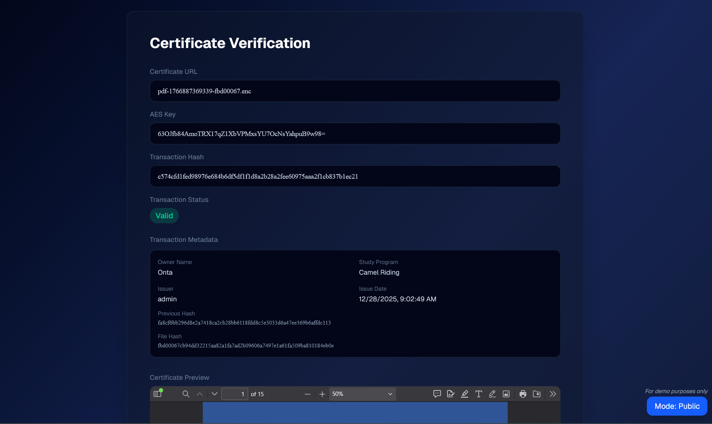

# Secure Certificates

## Tugas Besar II IF4020 Kriptografi

<div style="text-align: justify;">
This is a centralized immutable ledger system for certificate issuance and verification. It provides a secure and transparent way to manage digital certificates using blockchain-like technology, ensuring the integrity and authenticity of issued documents.
</div>
<br>

<div align="center">

</div>

### Example Transactions

#### Issue Transaction

```json
{
  "id": 6,
  "previous_hash": "fa8cf6bb296d8e2a7418ca2cb28bb6118fdd8c5e3033d6a47ee369b6affdc113",
  "current_hash": "c574cfd1fed98976e684b6df5df1f1d8a2b28a2fee60975aaa2f1cb837b1ec21",
  "transaction_type": "ISSUE",
  "metadata": {
    "action": "ISSUE",
    "issuer": "admin",
    "fileHash": "fbd00067cb94dd32215aa82a1fa7ad2b09606a7497e1a61fa509ba810184eb0e",
    "fileName": "pdf-1766887369339-fbd00067.enc",
    "ownerName": "Han Hyo-joo",
    "timestamp": "2025-12-28T02:02:49.360Z",
    "studyProgram": "Department of Theatre and Film"
  },
  "signature": "1/Qq5tWIcj0WHDucsB4HwwDd0aA16DSkHQZusrUQv51nH1eP0nCFZUURH+A6mDuNPQQ0HzglmFSEcqkv0TwIhg==",
  "created_at": "2025-12-28T02:02:49.362Z"
}
```

#### Revoke Transaction

```json
{
  "id": 5,
  "previous_hash": "86b050ba99267c6fdf12a758c636ced6f35867e914490fdc6a0ad605dca0f7a5",
  "current_hash": "fa8cf6bb296d8e2a7418ca2cb28bb6118fdd8c5e3033d6a47ee369b6affdc113",
  "transaction_type": "REVOKE",
  "metadata": {
    "action": "REVOKE",
    "issuer": "admin",
    "reason": "Expired",
    "timestamp": "2025-12-28T01:55:29.678Z",
    "target_cert_id": "86b050ba99267c6fdf12a758c636ced6f35867e914490fdc6a0ad605dca0f7a5"
  },
  "signature": "DrRWrkZitwD5xl3y/WgkeSUu5eEei75L3R/hA1LWLmOsyecfmOJ86zoGADzBD7VXCWKgFnnQIaZ5Kem3bkbrFA==",
  "created_at": "2025-12-28T01:55:29.679Z"
}
```

### Pages

| Page                     | Description                                               |
| ------------------------ | --------------------------------------------------------- |
| /search                  | Input certificate URL to verify (can directly insert URL) |
| /verify                  | Show verification status of a certificate                 |
| /transactions            | List of transactions in the ledger                        |
| /admin/login             | Admin login page                                          |
| /admin/certificates      | List of all issued certificates                           |
| /admin/certificates/{id} | Show certificate details and revoke option                |

### How to Run

1. Clone the repository:

   ```bash
   git clone https://github.com/rafimaliki/Tubes_2_Kriptografi
   cd Tubes_2_Kriptografi
   ```

2. Use Docker Compose to start the services:

   ```bash
   docker-compose up -d
   ```

3. For first-time setup, migrate the database:

   ```bash
   docker-compose exec backend npm run db:push
   ```

4. Access the application at `http://localhost:3000` for public access or `http://localhost:3000/admin` for admin access.

### Developers

| Name                           | NIM      | Contribution              |
| ------------------------------ | -------- | ------------------------- |
| Ahmad Rafi Maliki              | 13522137 | Authentication            |
| Muhammad Dzaki Arta            | 13522149 | Issue/Revoke certificates |
| Muhammad Rasheed Qais Tandjung | 13522158 | Verify certificates       |
